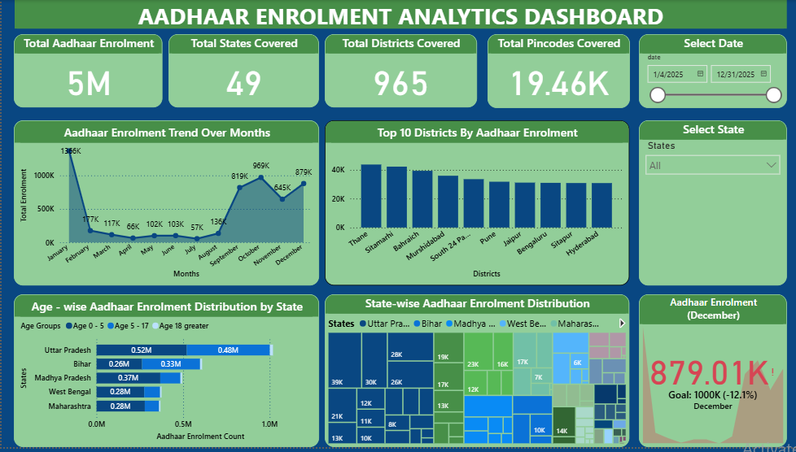

# aadhaar-enrolment-analytics
## Dashboard Preview

# Aadhaar Enrolment Analytics Dashboard

## Overview
Built an interactive Power BI dashboard analyzing Aadhaar enrolment trends 
across states, districts, months, and age groups using official UIDAI dataset.

## Key Findings
- Total Enrolment: 54.36 lakh (10.06 lakh rows)
- Peak Month: September 2025 — 13.66 lakh
- December missed 10 lakh target by 12.1%
- 65.3% of enrolments are children under 5 years

## Tools Used
- Power BI
- Power Query
- DAX
- UIDAI Open Government API

## Dataset
- 10,06,029 rows across 3 CSV files
- 7 columns: date, state, district, pincode, age_0_5, age_5_17, age_18_greater
- Period: April – December 2025
- Coverage: 49 states, 965 districts, 19,463 pincodes
